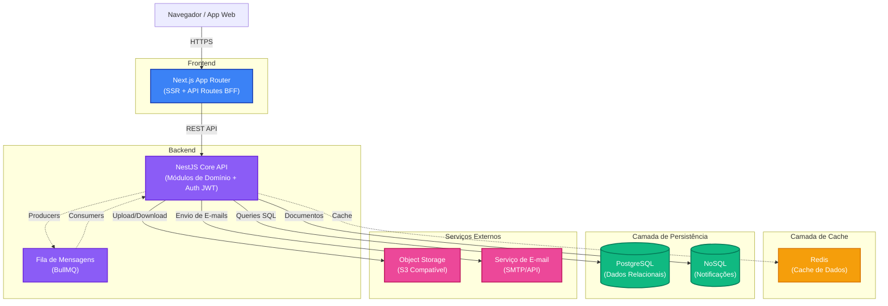
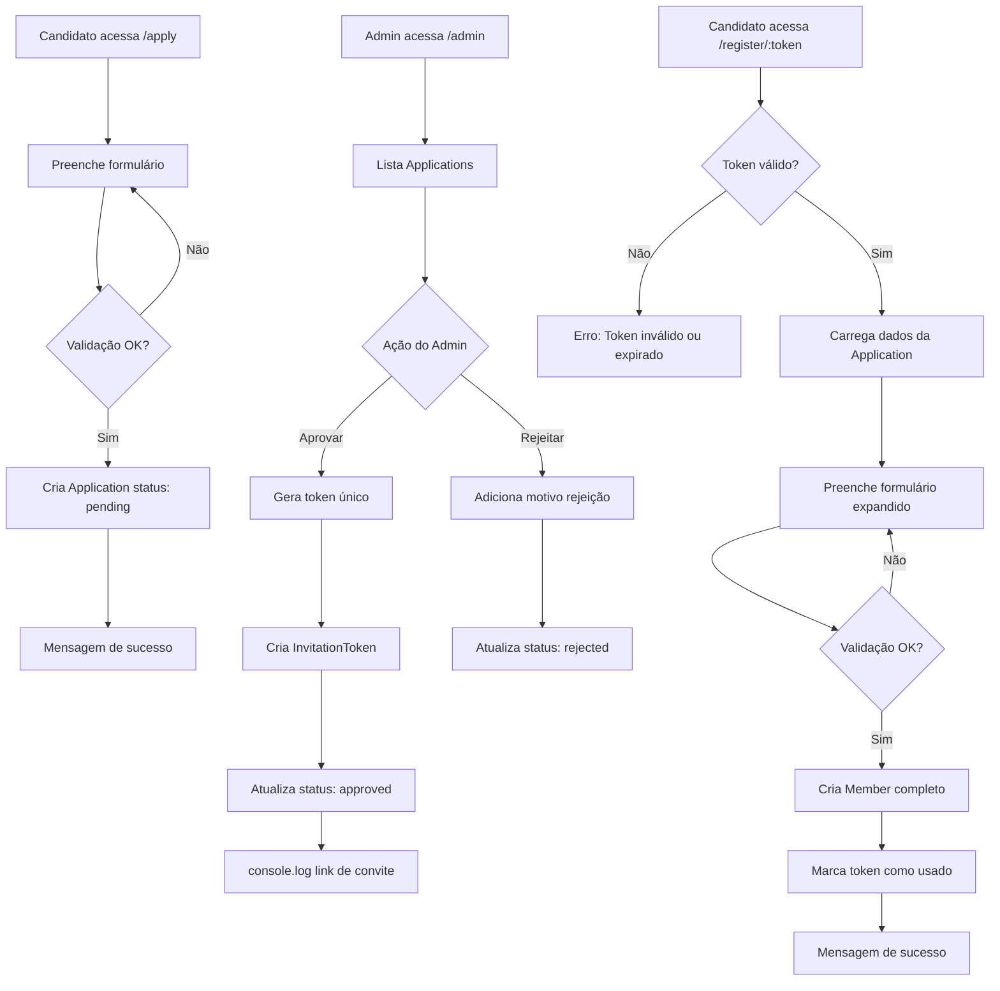

# Plataforma de Gestão para Grupos de Networking

## Visão Geral

Esta plataforma digitaliza a gestão de grupos de networking focados em geração de negócios. A solução é composta por duas aplicações separadas: **Frontend** (Next.js + React) e **Backend** (Node.js/NestJS), conectadas via API REST, com banco de dados PostgreSQL e Prisma ORM.

O sistema implementa um fluxo completo de admissão de membros, desde a intenção de participação até o cadastro completo do novo membro.

### Stack Tecnológica

- **Frontend**: Next.js 14+ com React e TypeScript
- **Backend**: NestJS com TypeScript  
- **Banco de Dados**: PostgreSQL
- **ORM**: Prisma
- **Validação Frontend**: React Hook Form + Zod
- **Validação Backend**: class-validator + class-transformer
- **Estilização**: Tailwind CSS
- **HTTP Client**: Axios

### Estrutura do Projeto

```
gestao-grupos-network/
├── frontend/          # Aplicação Next.js
├── backend/           # Aplicação NestJS
├── README.md          # Instruções de instalação
└── arquitetura.md     # Este documento
```

## Diagrama de Arquitetura



### Componentes da Arquitetura

- **Frontend (Next.js)**: aplicação em pasta separada (`frontend/`) com páginas públicas e administrativas. Consome a API backend via HTTP.
- **Backend (NestJS)**: aplicação em pasta separada (`backend/`) que expõe API REST usando NestJS com Prisma ORM.
- **PostgreSQL + Prisma**: banco de dados relacional com ORM Prisma para type-safety e migrações.
- **Redis**: usado para cache simples (opcional).
- **Object Storage**: pode usar sistema de arquivos local.
- **Serviço de E-mail**: simulado com `console.log()` para desenvolvimento.
- **Autenticação**: autenticação admin simples via variável de ambiente.

## Fluxo de Admissão de Membros

Módulo principal que implementa o processo completo de admissão de novos membros.

### Fluxograma do Processo



### 1. Página de Intenção (Pública)

**Rota**: `/apply`

**Funcionalidades**:
- Formulário público acessível sem autenticação
- Campos obrigatórios:
  - Nome completo
  - Email
  - Empresa
  - "Por que você quer participar?" (campo texto longo)
- Validação client-side e server-side
- Feedback de sucesso após submissão

### 2. Área Administrativa

**Rota**: `/admin` (protegida por variável de ambiente)

**Autenticação**: Simples verificação via variável de ambiente (não precisa de sistema de login completo)

**Funcionalidades**:
- Listar todas as intenções submetidas
- Filtros por status: pendente, aprovada, rejeitada
- Ações para cada intenção:
  - **Aprovar**: gera token único e "convite" no banco
  - **Rejeitar**: marca como rejeitada com motivo opcional
- Interface simples e funcional

### 3. Cadastro Completo

**Rota**: `/register/:token` (acessível apenas com token válido)

**Funcionalidades**:
- Validação do token de convite
- Formulário expandido com dados adicionais:
  - Telefone
  - Cargo/Posição
  - Descrição da empresa
  - LinkedIn (opcional)
  - Outros campos relevantes
- Criação do registro completo do membro
- Invalidação do token após uso

### 4. Fluxo de Notificação

**Implementação Simplificada**:
- Após aprovação: `console.log()` do link de cadastro
- Na vida real seria envio de email com o link
- Log deve conter: email do candidato e link completo

## Modelo de Dados Simplificado

### Tabelas Principais

```sql
-- Intenções de participação
CREATE TABLE applications (
    id UUID PRIMARY KEY DEFAULT gen_random_uuid(),
    full_name VARCHAR(255) NOT NULL,
    email VARCHAR(255) UNIQUE NOT NULL,
    company VARCHAR(255) NOT NULL,
    why_participate TEXT NOT NULL,
    status VARCHAR(20) DEFAULT 'pending', -- pending, approved, rejected
    reviewed_at TIMESTAMP,
    rejection_reason TEXT,
    created_at TIMESTAMP DEFAULT CURRENT_TIMESTAMP
);

-- Tokens de convite
CREATE TABLE invitation_tokens (
    id UUID PRIMARY KEY DEFAULT gen_random_uuid(),
    application_id UUID REFERENCES applications(id),
    token VARCHAR(255) UNIQUE NOT NULL,
    used BOOLEAN DEFAULT FALSE,
    expires_at TIMESTAMP NOT NULL,
    created_at TIMESTAMP DEFAULT CURRENT_TIMESTAMP
);

-- Membros completos
CREATE TABLE members (
    id UUID PRIMARY KEY DEFAULT gen_random_uuid(),
    application_id UUID REFERENCES applications(id),
    full_name VARCHAR(255) NOT NULL,
    email VARCHAR(255) UNIQUE NOT NULL,
    phone VARCHAR(50),
    company VARCHAR(255) NOT NULL,
    position VARCHAR(255),
    company_description TEXT,
    linkedin_url VARCHAR(500),
    created_at TIMESTAMP DEFAULT CURRENT_TIMESTAMP
);
```

## API Endpoints

### Public Endpoints

```
POST /api/applications
Body: { fullName, email, company, whyParticipate }
Response: { id, status: "pending" }
```

### Admin Endpoints

```
GET /api/admin/applications?status=pending
Headers: { x-admin-key: process.env.ADMIN_KEY }
Response: { applications: [...] }

POST /api/admin/applications/:id/approve
Headers: { x-admin-key: process.env.ADMIN_KEY }
Response: { token, inviteLink }

POST /api/admin/applications/:id/reject
Body: { reason? }
Headers: { x-admin-key: process.env.ADMIN_KEY }
Response: { status: "rejected" }
```

### Registration Endpoints

```
GET /api/invitations/:token
Response: { valid: boolean, application: {...} }

POST /api/members
Body: { token, phone, position, companyDescription, linkedinUrl }
Response: { member: {...} }
```

## Considerações de Implementação

### Frontend (Next.js)

#### Estrutura de Diretórios

```
frontend/
├── app/
│   ├── layout.tsx                 # Layout principal
│   ├── page.tsx                   # Página inicial
│   ├── apply/
│   │   └── page.tsx              # Formulário de aplicação
│   ├── admin/
│   │   └── page.tsx              # Dashboard admin
│   └── register/
│       └── [token]/
│           └── page.tsx          # Cadastro completo
├── components/
│   ├── ui/                        # Componentes base
│   │   ├── Button.tsx
│   │   ├── Input.tsx
│   │   ├── Textarea.tsx
│   │   └── Card.tsx
│   └── forms/                     # Componentes de formulário
│       ├── ApplicationForm.tsx
│       └── MemberRegistrationForm.tsx
├── lib/
│   ├── api.ts                     # Cliente API
│   ├── validations.ts             # Schemas Zod
│   └── utils.ts                   # Utilitários
└── types/
    └── index.ts                   # TypeScript types
```

#### Validações com Zod

```typescript
// Exemplo de schema de validação
const applicationSchema = z.object({
  fullName: z.string().min(3, "Nome deve ter ao menos 3 caracteres"),
  email: z.string().email("Email inválido"),
  company: z.string().min(2, "Nome da empresa obrigatório"),
  whyParticipate: z.string().min(50, "Por favor, explique com mais detalhes")
});
```

#### Cliente API

```typescript
// Configuração centralizada do Axios
const api = axios.create({
  baseURL: process.env.NEXT_PUBLIC_API_URL,
  headers: { 'Content-Type': 'application/json' }
});

// Exemplo de função
export const createApplication = async (data: ApplicationData) => {
  const response = await api.post('/applications', data);
  return response.data;
};
```

### Backend (NestJS)

#### Estrutura de Diretórios

```
backend/
├── src/
│   ├── main.ts                    # Entry point
│   ├── app.module.ts              # Módulo raiz
│   ├── applications/
│   │   ├── applications.module.ts
│   │   ├── applications.controller.ts
│   │   ├── applications.service.ts
│   │   └── dto/
│   │       ├── create-application.dto.ts
│   │       └── update-application.dto.ts
│   ├── invitations/
│   │   ├── invitations.module.ts
│   │   ├── invitations.controller.ts
│   │   └── invitations.service.ts
│   ├── members/
│   │   ├── members.module.ts
│   │   ├── members.controller.ts
│   │   ├── members.service.ts
│   │   └── dto/
│   │       └── create-member.dto.ts
│   ├── common/
│   │   ├── guards/
│   │   │   └── admin.guard.ts
│   │   └── filters/
│   │       └── http-exception.filter.ts
│   └── prisma/
│       ├── prisma.module.ts
│       └── prisma.service.ts
└── prisma/
    ├── schema.prisma
    ├── migrations/
    └── seed.ts
```

#### Exemplos de DTOs

```typescript
// create-application.dto.ts
export class CreateApplicationDto {
  @IsString()
  @MinLength(3)
  fullName: string;

  @IsEmail()
  email: string;

  @IsString()
  @MinLength(2)
  company: string;

  @IsString()
  @MinLength(50)
  whyParticipate: string;
}
```

#### Guard de Autenticação Admin

```typescript
@Injectable()
export class AdminGuard implements CanActivate {
  canActivate(context: ExecutionContext): boolean {
    const request = context.switchToHttp().getRequest();
    const adminKey = request.headers['x-admin-key'];
    return adminKey === process.env.ADMIN_KEY;
  }
}
```

### Banco de Dados

#### Schema Prisma Completo

```prisma
// schema.prisma
datasource db {
  provider = "postgresql"
  url      = env("DATABASE_URL")
}

generator client {
  provider = "prisma-client-js"
}

model Application {
  id                String             @id @default(uuid())
  fullName          String             @map("full_name")
  email             String             @unique
  company           String
  whyParticipate    String             @map("why_participate") @db.Text
  status            ApplicationStatus  @default(PENDING)
  reviewedAt        DateTime?          @map("reviewed_at")
  rejectionReason   String?            @map("rejection_reason") @db.Text
  createdAt         DateTime           @default(now()) @map("created_at")
  
  invitationToken   InvitationToken?
  member            Member?

  @@map("applications")
}

model InvitationToken {
  id            String      @id @default(uuid())
  applicationId String      @unique @map("application_id")
  token         String      @unique
  used          Boolean     @default(false)
  expiresAt     DateTime    @map("expires_at")
  createdAt     DateTime    @default(now()) @map("created_at")
  
  application   Application @relation(fields: [applicationId], references: [id], onDelete: Cascade)

  @@map("invitation_tokens")
}

model Member {
  id                   String    @id @default(uuid())
  applicationId        String    @unique @map("application_id")
  fullName             String    @map("full_name")
  email                String    @unique
  phone                String?
  company              String
  position             String?
  companyDescription   String?   @map("company_description") @db.Text
  linkedinUrl          String?   @map("linkedin_url")
  createdAt            DateTime  @default(now()) @map("created_at")
  
  application          Application @relation(fields: [applicationId], references: [id], onDelete: Cascade)

  @@map("members")
}

enum ApplicationStatus {
  PENDING
  APPROVED
  REJECTED
}
```

#### Comandos Úteis

- **Gerar client**: `npx prisma generate`
- **Criar migration**: `npx prisma migrate dev --name init`
- **Abrir Prisma Studio**: `npx prisma studio`
- **Reset database**: `npx prisma migrate reset`

### Tratamento de Erros

#### Backend

```typescript
// Filtro global de exceções
@Catch(HttpException)
export class HttpExceptionFilter implements ExceptionFilter {
  catch(exception: HttpException, host: ArgumentsHost) {
    const ctx = host.switchToHttp();
    const response = ctx.getResponse();
    const status = exception.getStatus();
    
    response.status(status).json({
      statusCode: status,
      message: exception.message,
      timestamp: new Date().toISOString(),
    });
  }
}
```

#### Frontend

```typescript
// Tratamento de erros do Axios
api.interceptors.response.use(
  (response) => response,
  (error) => {
    const message = error.response?.data?.message || 'Erro ao processar requisição';
    // Exibir toast ou mensagem de erro
    return Promise.reject(new Error(message));
  }
);
```

### Segurança e Validação

- **Validação dupla**: Client-side (Zod) + Server-side (class-validator)
- **Sanitização**: Trim de strings e validação de formatos
- **Rate limiting**: Implementar limite de requisições por IP (opcional)
- **CORS**: Configurar apenas origens permitidas
- **Tokens**: Expiração de 7 dias para invitation tokens
- **Ambiente**: Variáveis sensíveis apenas em .env (nunca no código)

## Status de Implementação

### Módulo Obrigatório: Fluxo de Admissão de Membros

1. **Página de Aplicação** (`/apply`)
   - Formulário público de intenção
   - Validação client-side e server-side
   - Feedback visual de sucesso/erro

2. **Área Administrativa** (`/admin`)
   - Listagem de applications
   - Filtros por status (pending, approved, rejected)
   - Ações de aprovação e rejeição
   - Geração de links de convite

3. **Cadastro Completo** (`/register/:token`)
   - Validação de token único
   - Formulário expandido para membro
   - Criação de registro completo

4. **API REST Completa**
   - Endpoints públicos e administrativos
   - Autenticação via x-admin-key
   - Validação de dados

5. **Banco de Dados**
   - PostgreSQL com Prisma ORM
   - Migrations e schema versionado
   - Relacionamentos entre entidades

## Funcionalidades Futuras

- Dashboard com métricas
- Sistema de indicações entre membros
- Controle de reuniões e presença
- Módulo financeiro
- Notificações por email reais
- Autenticação completa com JWT