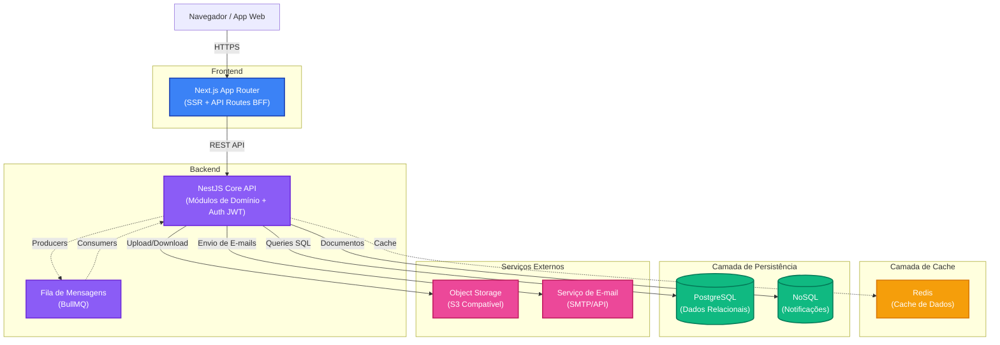

# Plataforma de Gestão para Grupos de Networking

## Visão Geral

O objetivo desta plataforma é centralizar a gestão de um grupo de networking com foco em geração de negócios, contemplando desde o funil de entrada de novos membros até o acompanhamento de performance e finanças. A solução proposta utiliza um monorepositório com Next.js (App Router) para o frontend e uma camada de backend em Node.js (NestJS), apoiada por PostgreSQL como banco de dados relacional. Serviços auxiliares como Redis, object storage e um pipeline próprio de autenticação por JWT garantem escalabilidade, segurança e boa experiência de uso.

## Diagrama de Arquitetura

- **Next.js App Router**: entrega páginas (SSR/SSG) e duas camadas de API: rotas públicas (formulários) e rotas autenticadas (BFF) que se comunicam via HTTPS com a API core.
- **NestJS Core API**: encapsula domínios como Membros, Reuniões, Indicações, Financeiro e Autenticação. Emite e valida JWTs, expõe endpoints REST e publica eventos assíncronos em filas.
- **PostgreSQL**: persistência principal. Optamos por um banco relacional para garantir integridade referencial, queries analíticas e suporte a relatórios.
- **Redis**: usado para caching de dashboards, métricas e orquestração de filas BullMQ (envio de e-mails, notificações).
- **Object Storage**: armazenamento de anexos (ex.: contratos, comprovantes).
- **Serviço de E-mail**: envio de notificações operacionais (aprovação, lembretes, cobranças).
- **Banco NoSQL**: persistência de notificações, preferências de entrega e histórico em tempo quase real para suportar fan-out e consultas flexíveis.
- **Autenticação JWT**: emitida e validada pela própria API NestJS. Tokens stateless sem necessidade de armazenamento em cache, com refresh tokens gerenciados pela aplicação.

## Modelo de Dados (PostgreSQL)

### Entidades Principais

| Tabela | Campos (tipo, descrição) | Observações |
| --- | --- | --- |
| `users` | `id (uuid PK)`, `email (varchar, unique)`, `password_hash (varchar, opcional)`, `role (enum: admin, member, guest)`, `status (enum: invited, active, suspended)`, `created_at`, `updated_at` | Identidade dos usuários. Admins e membros autenticados. |
| `member_profiles` | `id (uuid PK)`, `user_id (uuid FK users)`, `full_name`, `company`, `position`, `segment`, `bio`, `phone`, `social_links (jsonb)`, `joined_at`, `avatar_url` | Dados complementares do membro. |
| `applications` | `id (uuid PK)`, `email`, `full_name`, `company`, `segment`, `pitch_text`, `status (enum: pending, approved, rejected)`, `reviewed_by (uuid FK users)`, `reviewed_at`, `created_at` | Intenções de participação submetidas pelo formulário público. |
| `announcements` | `id (uuid PK)`, `title`, `body`, `audience (enum: all, admins)`, `publish_at`, `created_by (uuid FK users)`, `created_at`, `updated_at` | Comunicados. |
| `meetings` | `id (uuid PK)`, `type (enum: weekly, one_on_one, special)`, `title`, `scheduled_at`, `location`, `agenda`, `created_by (uuid FK users)` | Reuniões do grupo. |
| `meeting_attendance` | `id (uuid PK)`, `meeting_id (uuid FK meetings)`, `member_id (uuid FK users)`, `status (enum: present, absent, guest)`, `checked_in_at` | Controle de presença. |
| `referrals` | `id (uuid PK)`, `from_member_id (uuid FK users)`, `to_member_id (uuid FK users)`, `prospect_name`, `prospect_contact`, `description`, `value_estimate`, `status (enum: sent, in_progress, closed_won, closed_lost)`, `closed_at`, `created_at` | Indicações de negócios. |
| `gratitudes` | `id (uuid PK)`, `referral_id (uuid FK referrals)`, `message`, `created_by (uuid FK users)`, `created_at` | “Obrigados” vinculados a negócios fechados. |
| `one_on_one_sessions` | `id (uuid PK)`, `host_id (uuid FK users)`, `guest_id (uuid FK users)`, `scheduled_at`, `notes`, `completed_at` | Controle de reuniões 1:1. |
| `metrics_snapshots` | `id (uuid PK)`, `member_id`, `period_start`, `period_end`, `metric_type (enum)`, `value`, `created_at` | Base para dashboards e relatórios agregados. |
| `invoices` | `id (uuid PK)`, `member_id (uuid FK users)`, `amount`, `due_date`, `status (enum: pending, paid, overdue, canceled)`, `reference_period`, `issued_at`, `paid_at`, `payment_reference` | Controle financeiro de mensalidades. |
| `audit_logs` | `id (uuid PK)`, `entity`, `entity_id`, `action`, `performed_by`, `payload (jsonb)`, `created_at` | Trilhas de auditoria para ações críticas. |

### Relacionamentos e Considerações

- `users` 1:N `member_profiles` (1:1 conceitual, porém 1:N para flexibilidade futura).
- `users` 1:N `referrals` (como remetente e destinatário).
- `meetings` 1:N `meeting_attendance`.
- `referrals` 1:N `gratitudes`.
- `users` 1:N `invoices`; `invoices` correlacionam-se com `metrics_snapshots` para KPIs financeiros.
- Uso de `enum` nativo do PostgreSQL para status críticos. Campos textuais longos como `body` ou `description` definidos como `text`.
- `metrics_snapshots` alimentados por rotinas agendadas (cron jobs) que agregam dados de `referrals`, `meeting_attendance` e `invoices`.

## Estrutura de Componentes (Frontend Next.js)

- **`app/`**: rotas do Next.js (App Router). Subpastas para áreas públicas (`/apply`) e autenticadas (`/dashboard`, `/admin`). Uso de layouts segmentados.
- **`components/ui/`**: biblioteca de componentes atômicos (botões, inputs, tabelas, modais) com estilização consistente (ex.: Tailwind + Radix UI).
- **`components/forms/`**: formulários reutilizáveis com React Hook Form/Zod (validação compartilhada com backend).
- **`components/features/`**: componentes especializados por domínio (ex.: `applications/ApplicationReviewTable`, `meetings/AttendanceTable`, `referrals/ReferralPipeline`).
- **`modules/` ou **`features/`**: pastas que agrupam lógica de estado, hooks (`useReferrals`, `useAttendance`), chamadas à API e páginas específicas.
- **Estado Global**: utilização de Zustand ou Redux Toolkit para estados compartilhados (ex.: sessão do usuário, filtros globais). React Query para gerenciamento de requests e cache de dados.
- **Internacionalização e Acessibilidade**: Next-intl para i18n; componentes UI seguindo WCAG.
- **Testes**: Testing Library + Playwright (E2E). Estrutura espelhada em `__tests__`.

## Definição de API (REST)

### 1. Integração de Candidaturas (Membership Applications)

- **POST `/api/public/applications`**
  - Request: `{ "email": "string", "fullName": "string", "company": "string", "segment": "string", "pitchText": "string" }`
  - Response 201: `{ "id": "uuid", "status": "pending" }`
  - Validação de taxa de envio (rate limit via Redis) e envio de e-mail de confirmação.

- **GET `/api/admin/applications`**
  - Auth: `role=admin`.
  - Query params: `status`, `page`, `pageSize`.
  - Response 200: `{ "data": [ { "id": "uuid", "fullName": "...", "status": "pending", "submittedAt": "ISO" } ], "meta": { "page": 1, "pageSize": 20, "total": 42 } }`

- **POST `/api/admin/applications/{id}/decide`**
  - Request: `{ "decision": "approved" | "rejected", "notes": "string?" }`
  - Response 200: `{ "id": "uuid", "status": "approved", "reviewedBy": "uuid", "reviewedAt": "ISO" }`
  - Ação aprovar dispara convite para completar cadastro (link com token).

### 2. Controle de Presença em Reuniões

- **POST `/api/meetings`**
  - Auth: `role=admin`.
  - Request: `{ "type": "weekly", "title": "string", "scheduledAt": "ISO", "location": "string", "agenda": "string?" }`
  - Response 201: `{ "id": "uuid", "scheduledAt": "ISO" }`

- **POST `/api/meetings/{id}/attendance`**
  - Auth: `role=admin` ou `role=member` (para auto check-in dependendo da regra).
  - Request: `{ "memberId": "uuid", "status": "present" | "absent" | "guest" }`
  - Response 200: `{ "meetingId": "uuid", "memberId": "uuid", "status": "present", "checkedInAt": "ISO" }`

- **GET `/api/meetings/{id}/attendance`**
  - Response 200: `{ "meetingId": "uuid", "attendees": [ { "memberId": "uuid", "fullName": "string", "status": "present", "checkedInAt": "ISO" }, ... ] }`

### 3. Sistema de Indicações de Negócios

- **POST `/api/referrals`**
  - Auth: `role=member`.
  - Request: `{ "toMemberId": "uuid", "prospectName": "string", "prospectContact": "string", "description": "string", "valueEstimate": 1200.00 }`
  - Response 201: `{ "id": "uuid", "status": "sent" }`

- **PATCH `/api/referrals/{id}`**
  - Auth: remetente ou admin.
  - Request: `{ "status": "in_progress" | "closed_won" | "closed_lost", "closedAt": "ISO?", "gratitudeMessage": "string?" }`
  - Response 200: `{ "id": "uuid", "status": "...", "updatedAt": "ISO" }`
  - Ao marcar como `closed_won`, opcionalmente cria um registro em `gratitudes`.

- **GET `/api/referrals/metrics?period=monthly`**
  - Resposta 200: `{ "period": "2025-10", "totalSent": 32, "totalWon": 12, "totalValueWon": 58000, "leaders": [ { "memberId": "uuid", "fullName": "string", "wins": 4 } ] }`

## Considerações Adicionais

- **Autenticação e Autorização**: JWTs stateless short-lived emitidos pelo módulo de Auth da API NestJS, com refresh tokens rotacionados e armazenados no PostgreSQL. RBAC simples com possibilidade de granularidade futura.
- **Observabilidade**: Logs estruturados (Pino), métricas Prometheus e tracing (OpenTelemetry) para monitoramento das APIs.
- **CI/CD**: GitHub Actions com pipelines separados para testes, lint, build e deploy (Vercel para frontend, AWS ECS/Fargate para backend).
- **Resiliência**: Circuit breakers (opossum) para integrações externas, retentativas exponenciais para filas, migrações gerenciadas via Prisma ou TypeORM.
- **Segurança**: Sanitização de inputs, proteção contra CSRF para rotas web, criptografia em repouso (KMS) para dados sensíveis.
